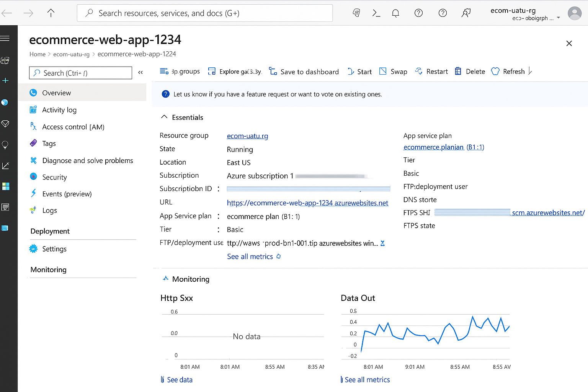

# ☁️ Armazenando Dados de um E-commerce na Cloud com Azure

## 🧾 Descrição do Projeto

Este projeto faz parte do desafio da DIO em parceria com a Microsoft, no qual o objetivo é desenvolver uma solução escalável, segura e eficiente para armazenar e gerenciar dados de um e-commerce na nuvem utilizando recursos da plataforma **Microsoft Azure**.

---

## 🛠️ Arquitetura da Solução

A arquitetura proposta está focada em escalabilidade, segurança e separação de responsabilidades entre os componentes do e-commerce. A solução inclui:

- **App Service (Web App)**: Hospedagem da aplicação web (frontend/backend).
- **Azure SQL Database**: Banco de dados relacional para armazenar pedidos, produtos, clientes e estoque.
- **Azure Blob Storage**: Armazenamento de imagens de produtos.
- **Azure Key Vault**: Armazenamento seguro de segredos e strings de conexão.
- **Application Insights**: Monitoramento e diagnóstico da aplicação.
- **Azure Monitor**: Log de eventos e métricas.

---

## 🔐 Segurança Implementada

- Uso de **Azure Key Vault** para proteger secrets e connection strings.
- Uso de políticas de **RBAC** (Controle de Acesso Baseado em Função).
- Comunicação via HTTPS.
- Ambientes isolados (produção, teste, desenvolvimento).

---

## 📈 Escalabilidade e Eficiência

- App Service em plano de **consumo** com **Auto Scaling**.
- Banco de dados com **Elastic Pool**.
- Armazenamento separado via Blob Storage.
- Logs centralizados com Application Insights + Azure Monitor.

---

## 🖼️ Prints do Projeto

### Web App no Azure


---

## 💡 Insights e Possibilidades Aprendidas

Durante a construção deste projeto, aprendi:

- Como estruturar uma aplicação em nuvem com componentes desacoplados.
- A importância do uso do Azure Key Vault para segurança de credenciais.
- Como monitorar a aplicação com Application Insights.
- Como escalar uma aplicação utilizando o plano certo de App Service.
- O valor de organizar os recursos em grupos (Resource Groups) para facilitar o controle e o gerenciamento.

---

## 📂 Organização dos Arquivos

```bash
📁 ecommerce-cloud-azure/
├── README.md
├── prints/
│   └── ecommerce.png

```

---

Projeto desenvolvido como parte do desafio DIO "Armazenando dados de um e-commerce na Cloud - Azure"
